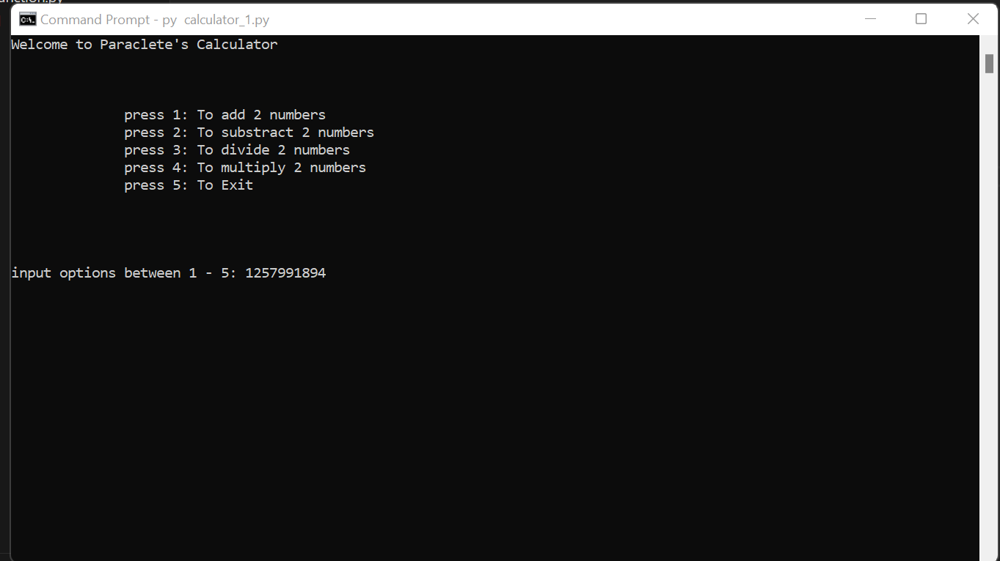

# Paraclete Simple Calculator

This project contains two versions of a simple calculator. The first version calculates operations on two numbers only, while the other version can calculate operations on multiple numbers.

## Features

- Addition
- Subtraction
- Division
- Multiplication

## Installation

1. Clone the repository:
    ```sh
    git clone <repository-url>
    ```
2. Navigate to the project directory:
    ```sh
    cd paraclete_py_calculator
    ```

## Usage

To run the first version of the calculator that operates on two numbers, use the following command:
```sh
py calculator_1.py
```

## Image of Calculator
